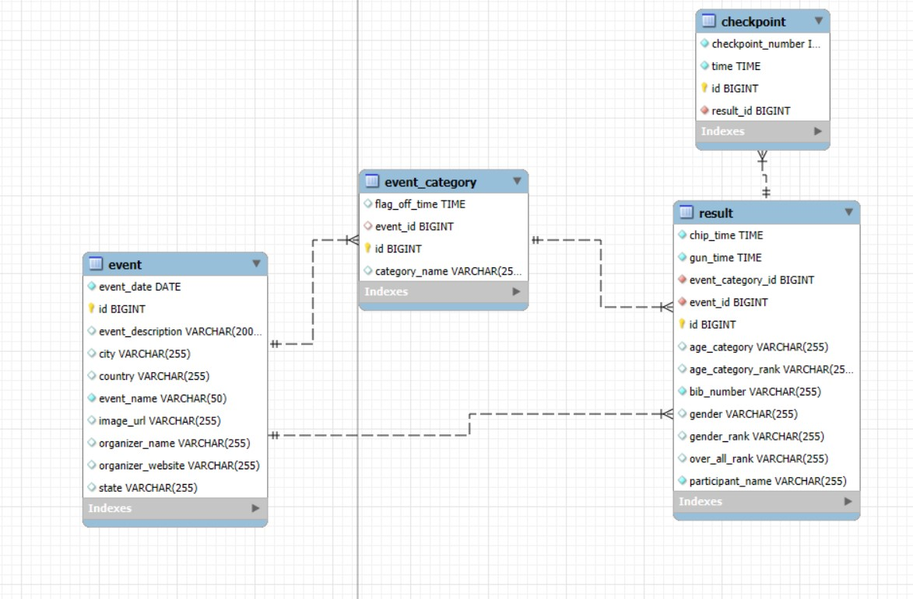

# Marathon Race Result REST API

A Spring Boot-based REST API for managing marathon race results with JWT authentication, Excel file upload capabilities, and batch processing functionality.

## Features

* **Secure Authentication** - JWT-based authentication and authorization
* **Excel Integration** - Upload and process race results via Excel files
* **Batch Processing** - Efficient handling of large datasets
* **Data Validation** - Robust input validation for all API requests
* **Documentation** - Swagger/OpenAPI integration
* **MySQL Database** - Persistent storage with JPA integration

## Tech Stack

* Java 17
* Spring Boot 3.5.0
* Spring Security with JWT
* Spring Batch
* Spring Data JPA
* MySQL
* Apache POI for Excel processing
* Lombok
* SpringDoc OpenAPI (Swagger UI)

## Prerequisites

* JDK 17 or higher
* MySQL Database
* Maven 3.x

## Installation

1. Clone the repository:
   ```bash
   git clone https://github.com/yourusername/race-result-api.git
   ```

2. Navigate to the project directory:
   ```bash
   cd race-result-api
   ```

3. Configure the database:
    - Create a MySQL database
    - Update `application.properties` with your database credentials


4. Build the project:
   ```bash
   ./mvnw clean install
   ```

5. Run the application:
   ```bash
   ./mvnw spring-boot:run
   ```

## API Documentation

Once the application is running, you can access the Swagger UI documentation at:
```
http://localhost:8080/swagger-ui/index.html
```

## Data Model

The API manages marathon race results with the following key entities:


## Database Schema



### Authentication
- User registration and login
- JWT token generation and validation
- Role-based access control


### Race Result
Contains participant information and race performance data. Every result belongs to an event, and event management is also supported:
- Bib number (unique identifier)
- Participant name
- Gender
- Race category
- Age category
- Overall rank
- Gender rank
- Age category rank
- Chip time
- Gun time
- Checkpoint times
- **Event** (each result is linked to an event)

### Event Management
- Create, read, update, and delete events
- Link race results to specific events


### Race Result Management
- Create, read, update, and delete race results
- Bulk upload results via Excel


### Batch Processing
- Asynchronous processing of large datasets
- Job monitoring and error handling


## Configuration

Key configuration options in `application.properties`:

```properties
# Database Configuration
spring.datasource.url=jdbc:mysql://localhost:3306/marathon_db
spring.datasource.username=root
spring.datasource.password=password

# JWT Configuration
jwt.secret=your-secret-key
jwt.expiration=86400000

# File Upload Configuration
spring.servlet.multipart.max-file-size=10MB
spring.servlet.multipart.max-request-size=10MB
```


## Contributing

To contribute, please take a branch from the `develop` branch before making your changes. After implementing your feature or fix, submit a pull request targeting the `develop` branch. Your ideas and improvements are highly appreciated!

1. Fork the repository
2. Create your feature branch (`git checkout -b feature/amazing-feature`)
3. Commit your changes (`git commit -m 'Add some amazing feature'`)
4. Push to the branch (`git push origin feature/amazing-feature`)
5. Open a Pull Request

**We welcome contributions! If you are interested in enhancing this project or adding new features, please feel free to open an issue or submit a pull request. Your ideas and improvements are highly appreciated.**

**If you would like to actively contribute, collaborate, or discuss new features, you can also contact me via email or on [LinkedIn](https://www.linkedin.com/in/connect2sandy/).**

## License

This project is licensed under the MIT License - see the LICENSE file for details.

## Author

Developed by Sandeepan Banerjee

## Contact

For questions or support, please reach out via:
- Email: contactsandeepan@gmail.com
- Website: https://connectwithsandeepan.in

